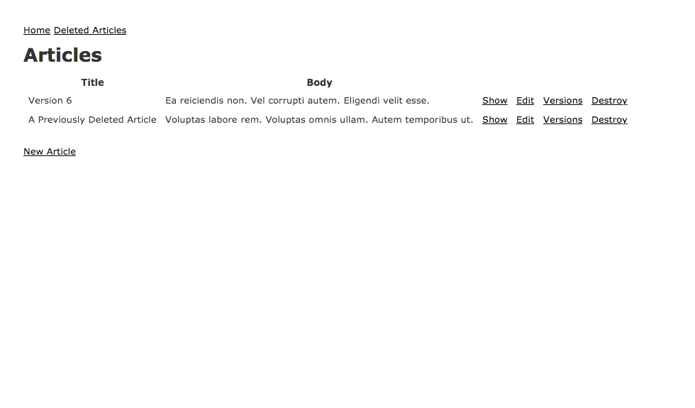
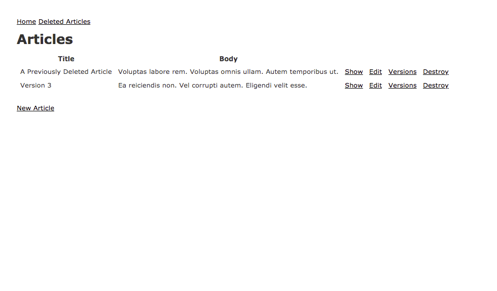

# PaperTrail Gem Tutorial

A tutorial that demonstrates how to revert and restore records using [paper_trail](https://github.com/paper-trail-gem/paper_trail).

## Revert a Previous Version



## Restoring a Previously Deleted Version



# Local Build

```
bundle install
rails db:setup
rails s
```

# Tests

```
rails t
```
